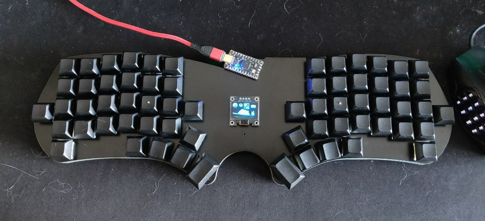

# snowslide

The Snowslide is an unibody split keyboard taking the
[Avalanche](https://github.com/vlkv/avalanche/) as inspiration.

* Keyboard Maintainer: [Jesus Climent](https://github.com/climent)
* Hardware Availability: Snowslide gerber files can be found [here](https://github.com/climent/avalanche/tree/snowslide)

## Bill of material

* 1 PCB
* 1 top plate
* 1 bottom plate
* 1 Elite-C controller
* 2x12 and 2x5 pin header and sockets for the Elite-C
* 64 keyboard MX switch sockets by Kailh (or less if you put encoders instead of keys)
* 64 keyboard MX switches (or less if you choose encoders)
* Keycaps, number according to the number of switches
* 64 (or less if you choose encoders) diodes 1N4148W or *what are the other possible diodes?*
* 1 tactile button, through-hole, 2 pins, that faces 90 degrees on the board (ex: https://www.aliexpress.com/item/32804448340.html)
* 11 M2 spaces, 6mm height
* 22 M2 screws, height has to be long enough to fix a 1.6mm thick PCB to the spacer, and short enough so two of them can fit in one spacer
* 8-10 adhesive rubber feet
* USB-C cable

Optional

* OLED, ssd1306 128x32 or 128x64 as you like, the latter looks better
* rotary encoders EC11, If you are not sure take EC11E. *NEEDS TO SAY HOW MUCH MAX*

## Steps

I recommend reading the [Sofle RGB build guide](https://josefadamcik.github.io/SofleKeyboard/build_guide_rgb.html) 
for the diodes, switch sockets, reset button and socketing the controller.

## Firmware

Make example for this keyboard (after setting up your build environment):

    make snowslide:default

Flashing example for this keyboard:

    make snowslide:default:flash

See the [build environment setup](https://docs.qmk.fm/#/getting_started_build_tools) and the [make instructions](https://docs.qmk.fm/#/getting_started_make_guide) for more information. Brand new to QMK? Start with our [Complete Newbs Guide](https://docs.qmk.fm/#/newbs).

## Bootloader

Enter the bootloader in 3 ways:

* **Bootmagic reset**: Hold down the key at (0,0) in the matrix (usually the top left key or Escape) and plug in the keyboard
* **Physical reset button**: Briefly press the button on the back of the PCB - some may have pads you must short instead
* **Keycode in layout**: Press the key mapped to `RESET` if it is available
